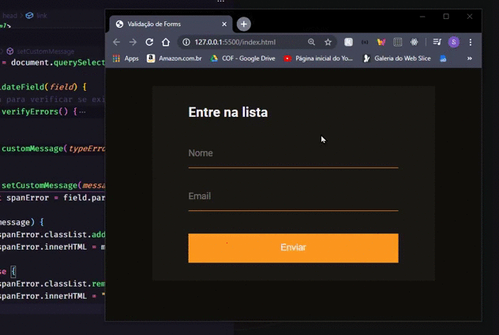

# Validacao de forms customizada :rocket:
 Repositório responsável por armazenar o mini projeto de customização de forms utilizando a API original do HTML

## Mini Projeto :rocket:

O mini projeto foi desenvolvido durante um *code drops* promovido pelo canal da *Rocketseat* no youtube. O objetivo é criar validações customizadas utilizando **HTML**, **CSS** e **JavaScript**. Ele consiste em um pequeno forms que possui dois inputs de tipos diferentes, e que, portanto, podem gerar erros diferentes.

## O que eu aprendi :book:

* Trabalhar com validações customizadas
* Entender os vários tipos de erros que podem ocorrer em um input que recebe o atributo required

## Tecnologias utilizadas :computer:

* HTML
* CSS
* JavaScript

## Como rodar :fire:

1. Clonar o repositório
1. Abrir o arquivo `index.html` e testar.
